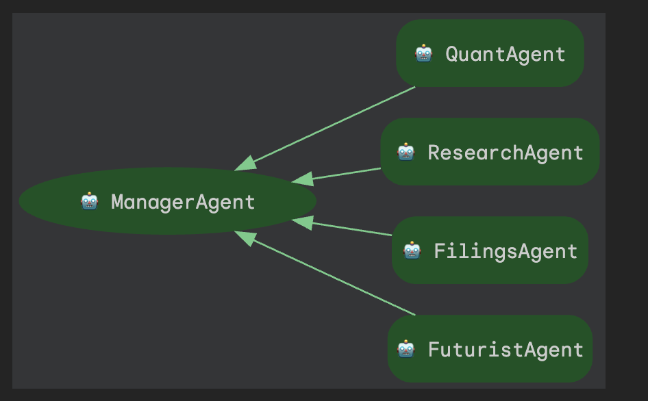

# Corporate Intelligence Agent

A multi-agent system built with Google's Agent Development Kit (ADK) that provides comprehensive financial analysis and corporate intelligence for publicly traded companies.

## Features

- **Multi-Agent Architecture**: Specialized agents for different analysis tasks
  - **QuantAgent**: Financial fundamentals analysis using yfinance
  - **ResearchAgent**: Latest news, risks, and market sentiment via Google Search
  - **FilingsAgent**: SEC filing analysis and regulatory insights
  - **FuturistAgent**: Monte-Carlo simulation-based price outlook
  - **ManagerAgent**: Orchestrates all specialists and synthesizes reports

- **Comprehensive Analysis**: Generates 3-paragraph reports covering:
  - Financial fundamentals and SEC filing highlights
  - Recent developments, risks, and market sentiment
  - Experimental 30-day price outlook

## Architecture

The system uses a hierarchical multi-agent architecture:



## Project Structure

```
corporate-intelligence-agent/
├── corporate_agent/          # Main agent directory (ADK-compatible)
│   ├── __init__.py
│   ├── agent.py              # Entry point - exports root_agent
│   ├── .env                  # API keys (GOOGLE_API_KEY)
│   ├── agents/               # Agent definitions
│   │   ├── __init__.py
│   │   ├── manager.py        # Manager agent orchestrator
│   │   └── specialists.py    # Specialist agents
│   └── tools/                # Financial analysis tools
│       ├── __init__.py
│       └── financial_tools.py
├── .gitignore
└── README.md
```

## Setup

### Prerequisites

- Python 3.10 or higher
- Google AI API Key (get one at https://aistudio.google.com/apikey)

### Installation

1. **Clone the repository**:
   ```bash
   git clone <your-repo-url>
   cd corporate-intelligence-agent
   ```

2. **Create and activate virtual environment**:
   ```bash
   python -m venv venv
   source venv/bin/activate  # On Windows: venv\\Scripts\\activate
   ```

3. **Install dependencies**:
   ```bash
   pip install google-adk yfinance numpy python-dotenv
   ```

4. **Set up environment variables**:
   Create a `.env` file in the `corporate_agent/` directory:
   ```bash
   echo "GOOGLE_API_KEY=your_api_key_here" > corporate_agent/.env
   ```

## Usage

### Option 1: Web UI (Recommended)

Start the ADK web server:

```bash
adk web --port 8080
```

Then open http://localhost:8080 in your browser, select `corporate_agent` from the dropdown, and start analyzing companies!

### Option 2: Interactive CLI

Run the agent in interactive mode:

```bash
adk run corporate_agent
```

Then type your queries:
```
[user]: Analyse Apple (AAPL)
[user]: Get fundamentals for TSLA
[user]: exit
```

## Example Output

```
**Summary**

Apple (AAPL) demonstrates robust financial health, boasting a market capitalization exceeding $4 trillion, a revenue growth rate of 7.9%, and operating margins of 31.6%. The company maintains a significant cash reserve of $54.7 billion, though it also carries $112.4 billion in debt, with a P/E ratio of 36.9 indicating strong investor confidence. Recent SEC filings highlight critical risks, including potential supply chain disruptions, ongoing antitrust litigation across multiple jurisdictions, and the impact of foreign exchange fluctuations on its international financial performance.

**Risks & Recent Developments**

Apple is currently navigating a complex landscape of global regulatory scrutiny, with significant antitrust investigations and lawsuits filed by the US Justice Department and European authorities concerning app store policies and market dominance. These legal challenges, alongside a separate securities lawsuit and a class-action suit related to Siri data, pose considerable risks. However, the company has seen positive reception for its latest iPhone series in China and continued growth in its Services segment, alongside a generally positive analyst and user sentiment.

**Experimental Outlook**

The experimental outlook for Apple (AAPL) over the next 30 days is moderately bullish, with a projected 61.74% probability of an increase in stock price, an expected return of 3.07%, and an anticipated volatility of 9.30%. This forecast carries an experimental Sharpe ratio of 0.82. It is important to note that this outlook is experimental and should not be considered investment advice.
```

## Architecture

The system uses a hierarchical multi-agent architecture:

1. **User Query** → **ManagerAgent**
2. **ManagerAgent** calls specialist agents in parallel:
   - QuantAgent (fundamentals)
   - ResearchAgent (news & sentiment)
   - FilingsAgent (SEC data)
   - FuturistAgent (price outlook)
3. **ManagerAgent** synthesizes all responses into a final report

## Tools & Technologies

- **Google ADK**: Agent orchestration framework
- **yfinance**: Financial data retrieval
- **Google Search**: News and sentiment analysis
- **NumPy**: Monte-Carlo simulations
- **Gemini 2.5 Flash Lite**: LLM for agent reasoning

## Future Enhancements

- Direct SEC EDGAR API integration
- Support for additional data sources (Bloomberg, Reuters)
- Enhanced risk analysis with NLP
- Portfolio-level analysis
- Historical backtesting of predictions

## License

MIT License

## Disclaimer

This tool is for educational and informational purposes only. The analysis and forecasts 
provided are experimental and should not be considered as investment advice. Always 
conduct your own research and consult with financial professionals before making 
investment decisions.
